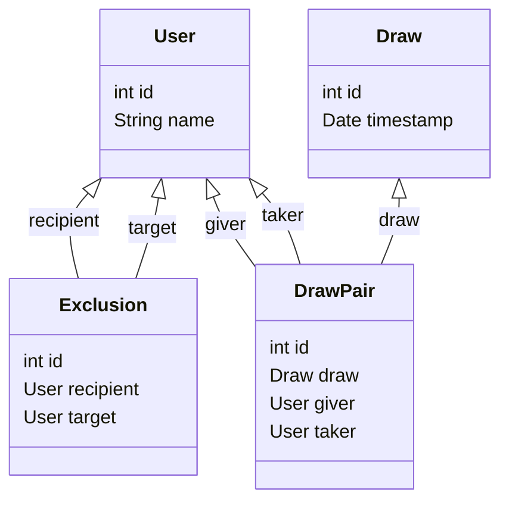

# Secret Santa API

Compute a secret santa list (shortened as "draw" ~= tirage au sort) from a DB of users and exclusions between users.

## Available features

1. List draws & Get draw details (+ user pairs)
2. List users & Get user details
3. Compute a new draw from the DB state
4. List latest draws with `GET /santa/draws?latest=5`

## Repo structure

`http` contains HTTP request examples as [http-request](https://www.jetbrains.com/help/idea/exploring-http-syntax.html) files. You can run them against a hostname with various IDE extensions (eg [VS Code Rest Client](https://marketplace.visualstudio.com/items?itemName=humao.rest-client)).

## Build & Run

This API is shipped with a Dockerfile.

You can build the Docker image & run it in a local container with:

```sh
make dev
# service is reachable on localhost:8080
# will stream logs
```

and also:

```sh
make logs # to show the full logs
make kill # stop the container
```

Or you can run the API directly with live reload (requires a virtual env):

```sh
make live
```

Then you can hit the following endpoints:

## Endpoints

Or check the examples in [http](http) (to be run with [VS Code Rest Client](https://marketplace.visualstudio.com/items?itemName=humao.rest-client)).

### Liveness

Check that your server is live by visiting http://localhost:8080/santa.

```http
GET /santa
```

### New draw

To compute a new draw:

```http
POST /santa/draws/
```

Keep in mind that this may fail as the drawing algorithm is not foolproof, in which case you should retry it.

### List draws

To return the metadata of all draws, do:

```http
GET /santa/draws
```

Use the detail endpoint to get the list of pairs for a given draw.

### Get full draw detail

```http
GET /santa/draws/15
```
Response:
```json
{
  "id": 15,
  "timestamp": "2023-12-18T16:24:47.625040Z",
  "pairs": [
    {
      "giver": 1,
      "taker": 5
    },
    {
      "giver": 2,
      "taker": 3
    },
    {
      "giver": 3,
      "taker": 4
    },
    {
      "giver": 4,
      "taker": 2
    },
    {
      "giver": 5,
      "taker": 1
    }
  ]
}
```

### Get draw history

Adding `latest=n` as a query param to your `GET /santa/draws` request will return the `n` latest draws:

```http
GET /santa/draws?latest=5
```

To see their user pairs, you will need to call `GET /santa/draws/{id}` for each of them.

## Core logic tests

You need to use `pytest` to run the tests found in `tests`:

```
python -m pytest tests -vv
```

## Models

- A `User` is a person with simply a name;
- An `Exclusion` tells us who (`target`) should not appear as the person to give a secret santa gift to for another person (`recipient`);
- A `Draw` is a secret santa list. It has a  creation datetimestamp;
- A `DrawPair` is a user pair inside a draw. It refers to its parent draw (`draw`) and the two users (`giver` and `taker` of the gift).

To generate a new secret santa list == a draw, we list all users and compute the user blacklist for each user (user id -> collection of user ids) from the list of exclusion rows. We then generate a list of random pairs where each user must be exactly once giver and taker, but not in the same pair, while following exclusions.

The result is a list of user id pairs belonging to one `Draw`, which we turn into `DrawPair` rows.

To deliver the full details of a draw, we scan the `draw_pair` table for rows pointing to this draw and return the list together with the draw's metadata.


